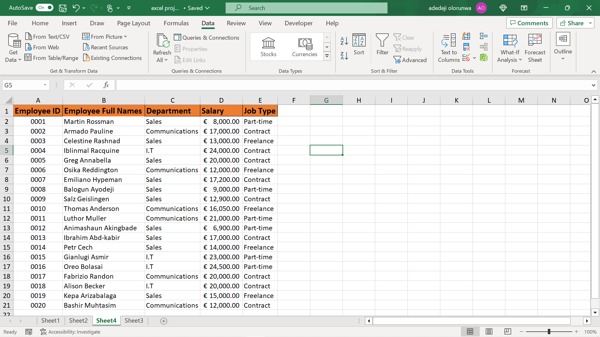

# Analysis-with-Excel

---

## Introduction
After the first week with our tutor in Data analysis class, Here is a simple analysis done on a Sales records for **company A**, Just my way of saying "Hello World" to the Data analysis space.😊

---

## Problem statement

1.  I created a table with 20 rows of information which shows the following fields below:  

Employee ID, Employee Full Name, Department (Communications, Sales, I.T), Salary (between $5000 to $25000), Job type (Part-time, Freelance, Contract) 

I duplicated the worksheet 1 into worksheet 2 and worksheet 3 

2.  In worksheet 1, I showed only employees who are ‘Freelancers’ and highlighted the ones whose salaries are above $10000.

3.  In worksheet 2, I split the employee's full names into first name and last name, Checked for duplicates enteries and highlighted it out. 

4.  In worksheet 3, I highlighted employees whose names begin with the letter ‘E’ (in yellow). I formatted the Salary column such that the highest SALARY has a green background, and the lowest SALARY has a red background. 

---

### Skills demonstrated
The following Excel features were demonstrated 
- Font Formatting, 
- Cell Formatting,
- Conditional Formatting, 
- Sorting and Filtering, 
- Text to column, 
- Flash fill, 
- Remove Duplicates, 
- Data validation, 
---

### Data Source

The data used was self-created as instructed the tutor for practices 

##### Raw data
-------------

